# Data Analysis and Visulization of What Trends on Youtube India
#### <a href="https://nbviewer.jupyter.org/github/PrakarshBhardwaj/Youtube-India-Data-Analysis/blob/master/youtube_india_data_analysis.ipynb">nbviewer</a> 
<a href="https://www.kaggle.com/datasnaek/youtube-new">Dataset</a>
  

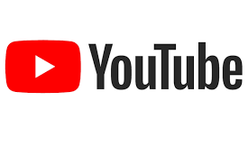</dev>  
  
## Data Preprocessing  
* Handing datetime and Timestamp data.  

* Map category ID of each video to the category it was tredning in.  

* Creating new variable *Number of Words in Title* to analyse how title length effects trending as people prefer concise titles.  

* Creating new variable *External links in video discription*.  
  * We have heard that youtube algorithm favoures videos with no external links. Lets see its effects on trending.  
  
* Dislike Fraction - How many of the assesments were dislikes.  
  * *Note - Some of the trending vidoes had 0 likes and 0 dislikes. To overcome this we use weighted laplance moving instead of actual ratio of dislikes/(dislikes +            likes).*  
  
* Handing missing values.  
  
* Creating new variable *Days before trending*.  
  
* Creating new variable *average views per day*.  
  
**Preprocessed Data is available in [__preprocessed_vids.csv__](https://github.com/PrakarshBhardwaj/Youtube-India-Data-Analysis/blob/master/preprocessed_vids.csv)**  
  
  
## Data Visulization  
### Views, Comments, Dislikes and Likes Distributions  
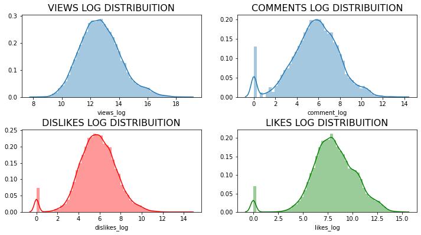  
  
  
  
### Trending v/s Time published  
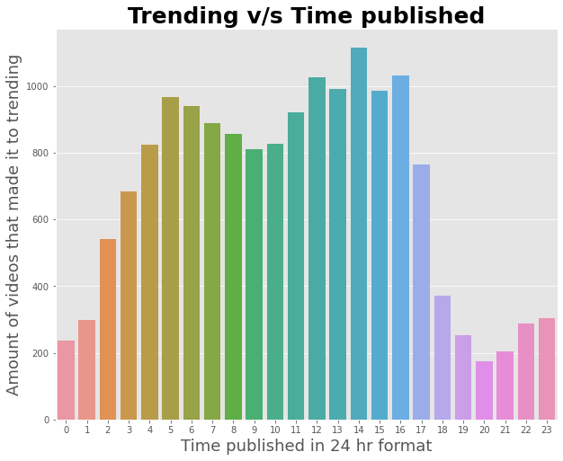  
  
  
  
### Feature Correlation - Spearman  
We use *spearman correlation* to account for non-linear corelations as well.  
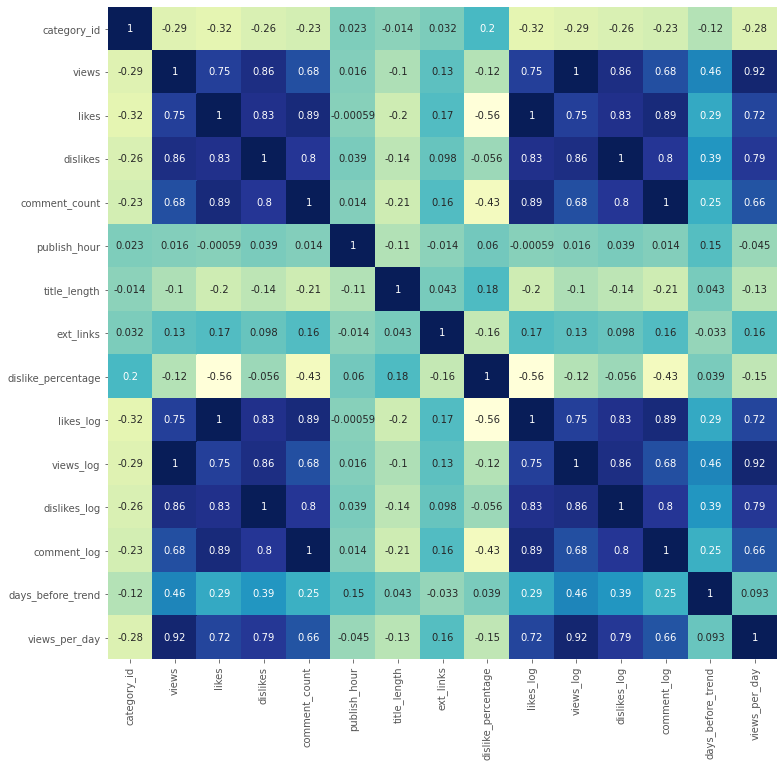  
  
  
  
### Effect of length of title on trending  
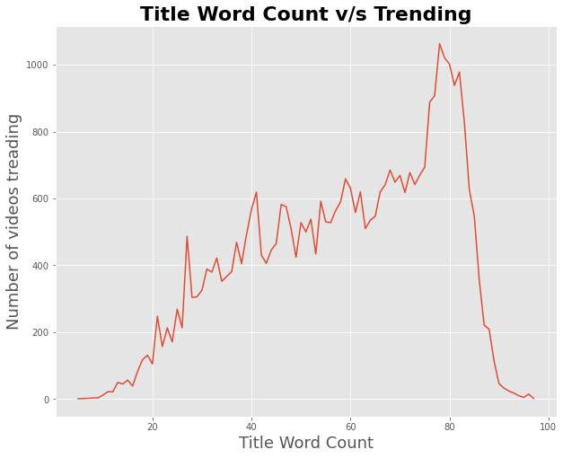  
  
  
  
### Effect of external links  
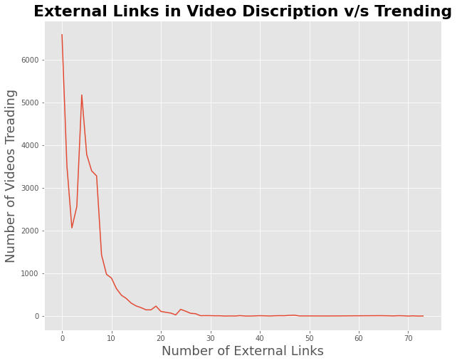  
  
We see a sharp dip from 0 to 2 and then a rise again.  
This maybe happing because music vidoes easily to trending and include more links to their other social media whereas channels include 2-4 links.  
  
  
  
### Popular channels  
Channels whose vidoes make it to trending the most.  
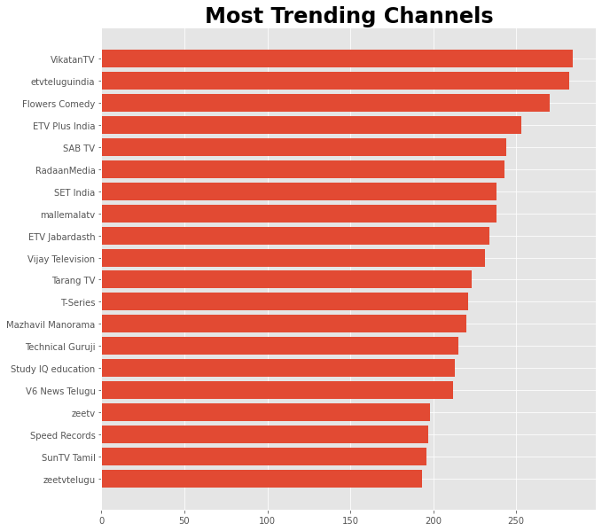  
  
  
  
### Trending topics  
Topics under which most vidoes made it to trending.  
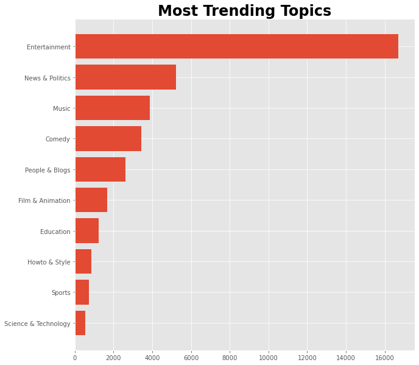  
  
  
  
### Days before trending  
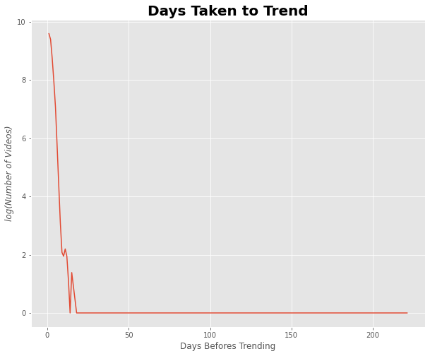  
  
  
  
### Most Hated Videos  
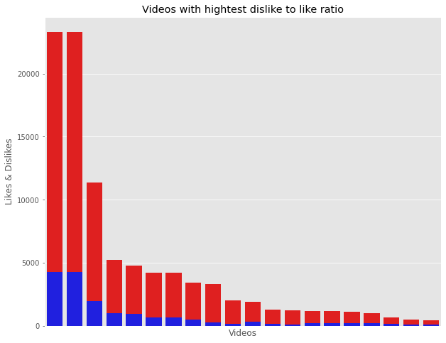  
  
  
  
### Tags  
Workcloud of most popular tags on trending.  
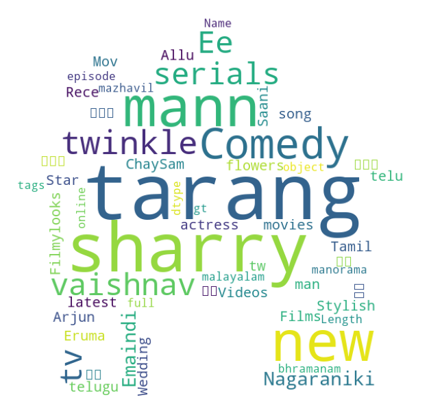  
  
  
## Dataset  
